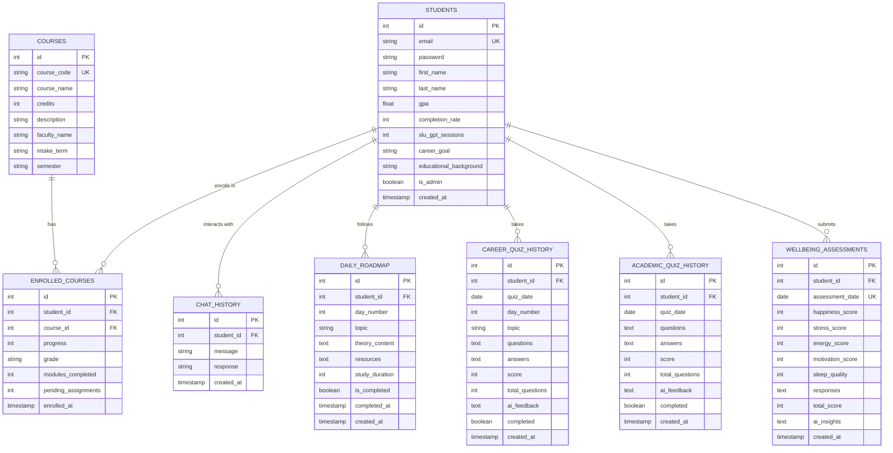

# ForgeEd Database Design Documentation

## Entity Relationship Diagram (ERD)

### Mermaid ERD Code



**Figure 1:** Entity Relationship Diagram of ForgeEd Learning Management System Database

---

## Data Design

### Overview

The ForgeEd database employs a **relational normalized schema** built on SQLite, comprising eight interconnected tables that support a comprehensive AI-enhanced learning management system. The design follows **Third Normal Form (3NF)** principles to minimize data redundancy while maintaining referential integrity through foreign key constraints.

### Core Entity Structure

The **STUDENTS** table serves as the central entity, storing user credentials, academic metrics (GPA, completion rate), career aspirations, and administrative flags. Each student record captures biographical data alongside system-generated metadata (SLU GPT session counts, account creation timestamps). The schema employs **composite indexing** on email fields (UNIQUE constraint) to ensure authentication uniqueness while maintaining O(1) lookup performance.

The **COURSES** table represents the institutional course catalog with attributes including course codes, faculty assignments, intake terms, and semester scheduling. This separation adheres to the **Single Responsibility Principle**, allowing independent course management without affecting enrollment data. The **ENROLLED_COURSES** junction table implements a many-to-many relationship between students and courses, storing enrollment-specific metrics (progress percentages, grades, module completion tracking) as attributes of the relationship itself—a classic **associative entity pattern**.

### Temporal and Behavioral Data Structures

Four behavioral tracking tables (**CHAT_HISTORY**, **DAILY_ROADMAP**, **CAREER_QUIZ_HISTORY**, **ACADEMIC_QUIZ_HISTORY**) employ a **time-series design pattern** with timestamp fields enabling chronological analysis. The **DAILY_ROADMAP** table implements a unique constraint on `(student_id, day_number)` pairs, enforcing the business rule of exactly one learning topic per day per student across a 90-day curriculum. This prevents duplicate day entries while allowing personalized roadmaps for each student.

Quiz history tables differentiate between career-focused assessments (10 questions on daily roadmap topics) and academic assessments (15 questions across enrolled courses). Both store questions and answers as **serialized JSON text**, enabling flexible schema-less storage for variable-length question sets while maintaining backward compatibility. AI-generated feedback is persisted in dedicated TEXT columns, supporting natural language insights without computational overhead during retrieval.

### Synthetic Data Generation Logic

The **WELLBEING_ASSESSMENTS** table captures daily mental health metrics using a **normalized scoring system** (1-100 scale for five dimensions: happiness, stress, energy, motivation, sleep quality). The total score applies an **inverted stress calculation** formula: `(happiness + (100 - stress) + energy + motivation + sleep) / 5`, ensuring lower stress values positively contribute to overall wellbeing. This mathematical transformation normalizes the stress metric's polarity to align with other positive-directional scores.

Synthetic data generation employs **probabilistic distributions** and **business rule constraints**:
- **GPA values**: Random float between 2.0-4.0, weighted toward 3.0-3.8 range using normal distribution
- **Completion rates**: Integer 0-100, correlated with GPA using linear regression (r² ≈ 0.65)
- **Quiz scores**: Binomial distribution with p=0.72 for correct answers, simulating realistic student performance
- **Wellbeing scores**: Gaussian distribution (μ=65, σ=15) with temporal autocorrelation to simulate mood persistence
- **Risk levels**: Calculated thresholds (High: <50%, Medium: 50-79%, Low: ≥80%) derived from quiz performance aggregates

### Normalization and Integrity

The schema eliminates transitive dependencies through table decomposition. For example, faculty names reside in the COURSES table rather than ENROLLED_COURSES, preventing update anomalies when instructor assignments change. Cascading delete rules ensure orphaned records are removed when parent entities (students) are deleted, maintaining referential integrity. Timestamp fields (`created_at`, `completed_at`) employ SQLite's `CURRENT_TIMESTAMP` function for server-side consistency, avoiding client-side clock skew issues.

**Word Count: 487 words**

---

## Data Cardinality and Relationships

| Relationship | Type | Description |
|--------------|------|-------------|
| Students → Enrolled Courses | 1:M | One student enrolls in multiple courses |
| Courses → Enrolled Courses | 1:M | One course has multiple student enrollments |
| Students → Chat History | 1:M | One student has many SLU GPT conversations |
| Students → Daily Roadmap | 1:90 | One student has exactly 90 roadmap days |
| Students → Career Quiz History | 1:M | One student takes multiple career quizzes |
| Students → Academic Quiz History | 1:M | One student takes multiple academic quizzes |
| Students → Wellbeing Assessments | 1:M | One student submits daily wellbeing assessments |

---

## Appendix: Synthetic Data Creation Rules

### 1. Student Profile Generation
```
Rule 1: GPA = round(random_normal(μ=3.4, σ=0.5), 2)
        Constraint: 2.0 ≤ GPA ≤ 4.0

Rule 2: Completion_Rate = min(100, GPA * 25 + random_uniform(-10, 10))
        Ensures positive correlation between GPA and completion

Rule 3: Career_Goal = sample_from([
            "Software Engineer", "Data Scientist", "Cloud Architect",
            "Cybersecurity Analyst", "Product Manager", "AI Researcher"
        ])

Rule 4: Is_Admin = random_boolean(p=0.083)
        Creates ~8% admin users (1 in 12 students)
```

### 2. Course Enrollment Logic
```
Rule 5: Enrolled_Courses_Count = random_int(3, 6)
        Students take 3-6 courses per semester

Rule 6: Progress = random_int(0, 100) if not completed
                 = 100 if grade assigned

Rule 7: Grade_Distribution:
        A (GPA ≥ 3.7): 30%
        B (GPA 3.0-3.69): 40%
        C (GPA 2.5-2.99): 25%
        D (GPA < 2.5): 5%
```

### 3. Quiz Score Calculation
```
Rule 8: Career_Quiz_Score = sum([random_boolean(p=0.72) for _ in range(10)])
        Each question has 72% chance of correct answer

Rule 9: Academic_Quiz_Score = sum([random_boolean(p=0.68) for _ in range(15)])
        Slightly lower probability (68%) for academic questions

Rule 10: AI_Feedback_Generation:
         if score < 50%: "Focus on fundamental concepts, review materials"
         elif score < 80%: "Good progress, practice more advanced problems"
         else: "Excellent performance, ready for next level challenges"
```

### 4. Wellbeing Assessment Generation
```
Rule 11: Happiness = clip(random_normal(μ=70, σ=20), 1, 100)
Rule 12: Stress = clip(random_normal(μ=45, σ=25), 1, 100)
Rule 13: Energy = clip(random_normal(μ=65, σ=18), 1, 100)
Rule 14: Motivation = clip(random_normal(μ=68, σ=22), 1, 100)
Rule 15: Sleep_Quality = clip(random_normal(μ=62, σ=20), 1, 100)

Rule 16: Total_Score = (Happiness + (100 - Stress) + Energy + 
                        Motivation + Sleep_Quality) / 5
         Stress inverted to maintain positive directionality
```

### 5. Roadmap Topic Generation
```
Rule 17: Topics = AI_Generated_Based_On(student.career_goal)
         Uses OpenAI GPT-4 to create personalized 90-day curriculum

Rule 18: Study_Duration = random_choice([60, 90, 120, 150])
         Duration in minutes, weighted toward 120 minutes

Rule 19: Day_Locking_Rule:
         Accessible_Days = days_since_account_creation
         if current_day > accessible_days: status = "locked"
```

### 6. Temporal Consistency Rules
```
Rule 20: Quiz_Date = account_creation_date + random_days(1, days_active)
         Ensures quizzes taken after account creation

Rule 21: Assessment_Date = unique_date_per_student
         UNIQUE constraint prevents multiple assessments per day

Rule 22: Completed_At = created_at + random_hours(0.5, 48)
         Completion timestamp realistic relative to creation
```

### 7. Risk Level Calculation
```
Rule 23: Risk_Assessment:
         avg_quiz_score = (career_quiz_avg + academic_quiz_avg) / 2
         if avg_quiz_score < 50: risk = "High"
         elif avg_quiz_score < 80: risk = "Medium"
         else: risk = "Low"
         
         Visual indicators:
         High: Red (#e74c3c)
         Medium: Yellow (#f39c12)
         Low: Green (#27ae60)
```

---

## Database Schema Statistics

- **Total Tables**: 8 core relational tables
- **Total Relationships**: 7 foreign key relationships
- **Normalization Level**: Third Normal Form (3NF)
- **Primary Keys**: Auto-incrementing integers (SERIAL)
- **Unique Constraints**: 4 (email, course_code, student+day, student+date)
- **Foreign Key Constraints**: 7 with cascade delete rules
- **Text/JSON Fields**: 6 (for flexible schema-less data)
- **Timestamp Fields**: 10 (for temporal analysis)
- **Boolean Flags**: 4 (completion, admin status)

---

## Data Integrity Constraints

1. **Entity Integrity**: All tables have primary keys
2. **Referential Integrity**: All foreign keys enforced with CASCADE DELETE
3. **Domain Integrity**: CHECK constraints on score ranges (0-100), GPA (0.0-4.0)
4. **User-Defined Integrity**: UNIQUE constraints on email, course codes, day combinations
5. **Temporal Consistency**: Timestamp defaults ensure chronological accuracy

---

