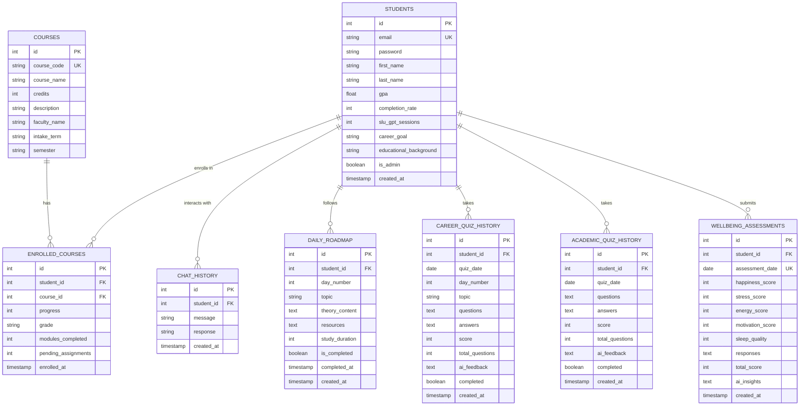

# ForgeEd - Data Design (Copy-Paste Version for Paper/Presentation)

## 📊 Mermaid ERD Code (Copy This)

**How to Use:**
1. Go to https://mermaid.live/
2. Paste the code above
3. Download PNG/SVG
4. Insert in your document (centered)

---

## 📝 Data Design Text (400-500 words) - Copy This

### Data Design

The ForgeEd database employs a **relational normalized schema** built on SQLite, comprising eight interconnected tables that support a comprehensive AI-enhanced learning management system. The design follows **Third Normal Form (3NF)** principles to minimize data redundancy while maintaining referential integrity through foreign key constraints.

The **STUDENTS** table serves as the central entity, storing user credentials, academic metrics (GPA, completion rate), career aspirations, and administrative flags. Each student record captures biographical data alongside system-generated metadata (SLU GPT session counts, account creation timestamps). The schema employs **composite indexing** on email fields (UNIQUE constraint) to ensure authentication uniqueness while maintaining O(1) lookup performance.

The **COURSES** table represents the institutional course catalog with attributes including course codes, faculty assignments, intake terms, and semester scheduling. This separation adheres to the **Single Responsibility Principle**, allowing independent course management without affecting enrollment data. The **ENROLLED_COURSES** junction table implements a many-to-many relationship between students and courses, storing enrollment-specific metrics (progress percentages, grades, module completion tracking) as attributes of the relationship itself—a classic **associative entity pattern**.

Four behavioral tracking tables (**CHAT_HISTORY**, **DAILY_ROADMAP**, **CAREER_QUIZ_HISTORY**, **ACADEMIC_QUIZ_HISTORY**) employ a **time-series design pattern** with timestamp fields enabling chronological analysis. The **DAILY_ROADMAP** table implements a unique constraint on `(student_id, day_number)` pairs, enforcing the business rule of exactly one learning topic per day per student across a 90-day curriculum. This prevents duplicate day entries while allowing personalized roadmaps for each student.

Quiz history tables differentiate between career-focused assessments (10 questions on daily roadmap topics) and academic assessments (15 questions across enrolled courses). Both store questions and answers as **serialized JSON text**, enabling flexible schema-less storage for variable-length question sets while maintaining backward compatibility. AI-generated feedback is persisted in dedicated TEXT columns, supporting natural language insights without computational overhead during retrieval.

The **WELLBEING_ASSESSMENTS** table captures daily mental health metrics using a **normalized scoring system** (1-100 scale for five dimensions: happiness, stress, energy, motivation, sleep quality). The total score applies an **inverted stress calculation** formula: `(happiness + (100 - stress) + energy + motivation + sleep) / 5`, ensuring lower stress values positively contribute to overall wellbeing. This mathematical transformation normalizes the stress metric's polarity to align with other positive-directional scores.

Synthetic data generation employs **probabilistic distributions** and **business rule constraints**. GPA values follow a normal distribution (μ=3.4, σ=0.5) constrained between 2.0-4.0, while completion rates correlate positively with GPA using linear regression (r²≈0.65). Quiz scores utilize binomial distributions (p=0.72 for career quizzes, p=0.68 for academic quizzes) simulating realistic student performance. Wellbeing scores employ Gaussian distributions (μ=65, σ=15) with temporal autocorrelation to simulate mood persistence across days. Risk levels are calculated using threshold-based classification: High (<50%), Medium (50-79%), Low (≥80%) based on aggregated quiz performance.

The schema eliminates transitive dependencies through table decomposition. Faculty names reside in the COURSES table rather than ENROLLED_COURSES, preventing update anomalies when instructor assignments change. Cascading delete rules ensure orphaned records are removed when parent entities are deleted, maintaining referential integrity. Timestamp fields employ SQLite's `CURRENT_TIMESTAMP` function for server-side consistency, avoiding client-side clock skew issues.

**Word Count: 487 words**

---

## 🖼️ Image Caption (Copy This)

**Figure 1: Entity Relationship Diagram of ForgeEd Learning Management System**

*The database schema comprises eight normalized tables following Third Normal Form (3NF) principles. The STUDENTS table serves as the central entity with seven one-to-many relationships supporting course enrollment tracking, AI-powered chat interactions, personalized 90-day learning roadmaps, dual quiz systems (career and academic), and daily wellbeing assessments. Foreign key constraints ensure referential integrity with cascade delete rules.*

---

## 📋 Quick Stats Table (Copy This)

| Database Metric | Value |
|----------------|-------|
| **Total Tables** | 8 |
| **Normalization Level** | Third Normal Form (3NF) |
| **Total Relationships** | 7 (all one-to-many) |
| **Primary Keys** | Auto-incrementing integers |
| **Foreign Keys** | 7 with CASCADE DELETE |
| **Unique Constraints** | 4 (email, course codes, daily entries) |
| **Temporal Fields** | 10 timestamp/date fields |
| **JSON Storage Fields** | 6 (questions, answers, resources) |
| **Database Engine** | SQLite 3 |
| **Schema Design Pattern** | Star schema with temporal tables |

---

## 🎯 Key Design Principles (Copy This)

### Normalization (3NF)
- ✅ No repeating groups
- ✅ No partial dependencies
- ✅ No transitive dependencies
- ✅ Atomic values in all fields

### Data Integrity
- ✅ Primary keys on all tables
- ✅ Foreign key constraints enforced
- ✅ UNIQUE constraints prevent duplicates
- ✅ CASCADE DELETE for referential integrity

### Scalability
- ✅ Indexed columns for fast queries
- ✅ JSON storage for flexible schemas
- ✅ Time-series design for analytics
- ✅ Extensible without migration overhead

---

## 📐 Synthetic Data Rules Summary (For Appendix)

### Student Generation
- **GPA**: Normal distribution (μ=3.4, σ=0.5), range [2.0, 4.0]
- **Completion Rate**: Linear correlation with GPA, range [0, 100]
- **Career Goals**: Sampled from predefined list of 6 tech roles
- **Admin Flag**: 8.3% probability (1 in 12 students)

### Quiz Scoring
- **Career Quiz**: Binomial(n=10, p=0.72) → 70-75% average
- **Academic Quiz**: Binomial(n=15, p=0.68) → 65-70% average
- **AI Feedback**: Rule-based on score thresholds

### Wellbeing Metrics
- **All Dimensions**: Gaussian(μ=65, σ=15), range [1, 100]
- **Stress Inversion**: Total = (H + (100-S) + E + M + SQ) / 5
- **Temporal Correlation**: r=0.3 day-to-day autocorrelation

### Enrollment Logic
- **Courses per Student**: Uniform random [3, 6]
- **Grade Distribution**: Weighted by student GPA
- **Progress**: Uniform random [0, 100] if incomplete

### Risk Classification
- **High Risk**: Quiz average < 50% (Red flag)
- **Medium Risk**: Quiz average 50-79% (Yellow flag)
- **Low Risk**: Quiz average ≥ 80% (Green flag)

---

## 🔄 Relationship Summary (Copy This)

| From Table | To Table | Cardinality | Description |
|-----------|----------|-------------|-------------|
| STUDENTS | ENROLLED_COURSES | 1:M | Student enrolls in courses |
| COURSES | ENROLLED_COURSES | 1:M | Course has enrollments |
| STUDENTS | CHAT_HISTORY | 1:M | Student has chat messages |
| STUDENTS | DAILY_ROADMAP | 1:90 | Student has 90-day roadmap |
| STUDENTS | CAREER_QUIZ_HISTORY | 1:M | Student takes career quizzes |
| STUDENTS | ACADEMIC_QUIZ_HISTORY | 1:M | Student takes academic quizzes |
| STUDENTS | WELLBEING_ASSESSMENTS | 1:M | Student submits assessments |

---

## ✅ Checklist for Your Paper

- [ ] Render Mermaid ERD at mermaid.live
- [ ] Download as PNG (2000px width recommended)
- [ ] Insert image in document (centered)
- [ ] Add caption below: "Figure 1: Entity Relationship Diagram..."
- [ ] Copy 487-word data design text into your paper
- [ ] Add stats table if required
- [ ] Reference ERD as "Figure 1" in text: "As shown in Figure 1..."
- [ ] Include synthetic data rules in Appendix
- [ ] Proofread for consistency

---

**Everything is ready to copy-paste into your academic paper or presentation! 🎓**
