# ForgeEd Database - Entity Relationship Diagram

---

## How to View the ERD

### Method 1: Mermaid Live Editor (Recommended)
1. Copy the Mermaid code below
2. Go to: https://mermaid.live/
3. Paste the code in the editor
4. Click "Download PNG" or "Download SVG"
5. Insert image in your document/presentation

### Method 2: GitHub/GitLab (Auto-renders)
1. Create a `.md` file in your repository
2. Paste the code block with ```mermaid
3. GitHub/GitLab will automatically render it

### Method 3: VS Code Extension
1. Install "Markdown Preview Mermaid Support" extension
2. Open this file in VS Code
3. Press Ctrl+Shift+V to preview
4. Right-click diagram → Save as image

---

## Mermaid ERD Code

```mermaid
erDiagram
    STUDENTS ||--o{ ENROLLED_COURSES : "enrolls in"
    COURSES ||--o{ ENROLLED_COURSES : "has"
    STUDENTS ||--o{ CHAT_HISTORY : "interacts with"
    STUDENTS ||--o{ DAILY_ROADMAP : "follows"
    STUDENTS ||--o{ CAREER_QUIZ_HISTORY : "takes"
    STUDENTS ||--o{ ACADEMIC_QUIZ_HISTORY : "takes"
    STUDENTS ||--o{ WELLBEING_ASSESSMENTS : "submits"

    STUDENTS {
        int id PK
        string email UK "Unique, Not Null"
        string password "Hashed in production"
        string first_name
        string last_name
        float gpa "0.0 to 4.0"
        int completion_rate "0 to 100 percent"
        int slu_gpt_sessions "Session counter"
        string career_goal "AI personalization key"
        string educational_background
        boolean is_admin "Role flag"
        timestamp created_at "Day-locking reference"
    }

    COURSES {
        int id PK
        string course_code UK "e.g., IS 5000"
        string course_name
        int credits "Default: 3"
        string description
        string faculty_name "Instructor"
        string intake_term "e.g., Fall 2025"
        string semester "1, 2, or 3"
    }

    ENROLLED_COURSES {
        int id PK
        int student_id FK "References STUDENTS"
        int course_id FK "References COURSES"
        int progress "0 to 100 percent"
        string grade "A, B+, etc."
        int modules_completed
        int pending_assignments
        timestamp enrolled_at
    }

    CHAT_HISTORY {
        int id PK
        int student_id FK "References STUDENTS"
        string message "User query"
        string response "AI response with formatting"
        timestamp created_at "Conversation chronology"
    }

    DAILY_ROADMAP {
        int id PK
        int student_id FK "References STUDENTS"
        int day_number "1 to 90"
        string topic "AI-generated learning topic"
        text theory_content "Rich educational content"
        text resources "JSON: external links"
        int study_duration "Minutes, default: 120"
        boolean is_completed "Day completion flag"
        timestamp completed_at "When completed"
        timestamp created_at
    }

    CAREER_QUIZ_HISTORY {
        int id PK
        int student_id FK "References STUDENTS"
        date quiz_date "When quiz taken"
        int day_number "Linked to roadmap day"
        string topic "Quiz topic"
        text questions "JSON: 10 questions"
        text answers "JSON: user responses"
        int score "0 to 10"
        int total_questions "Always 10"
        text ai_feedback "Personalized insights"
        boolean completed
        timestamp created_at
    }

    ACADEMIC_QUIZ_HISTORY {
        int id PK
        int student_id FK "References STUDENTS"
        date quiz_date
        text questions "JSON: 15 questions, 5 per course"
        text answers "JSON: user responses"
        int score "0 to 15"
        int total_questions "Always 15"
        text ai_feedback "Performance analysis"
        boolean completed
        timestamp created_at
    }

    WELLBEING_ASSESSMENTS {
        int id PK
        int student_id FK "References STUDENTS"
        date assessment_date UK "One per day per student"
        int happiness_score "1 to 100"
        int stress_score "1 to 100, inverted"
        int energy_score "1 to 100"
        int motivation_score "1 to 100"
        int sleep_quality "1 to 100"
        text responses "Optional journal"
        int total_score "Calculated average"
        text ai_insights "Motivational feedback"
        timestamp created_at
    }
```



---

## Caption for Presentation/Paper

**Figure 1: Entity Relationship Diagram of ForgeEd Learning Management System**

*The database schema comprises eight normalized tables following Third Normal Form (3NF) principles. The STUDENTS table serves as the central entity with seven one-to-many relationships supporting course enrollment tracking, AI-powered chat interactions, personalized 90-day learning roadmaps, dual quiz systems (career and academic), and daily wellbeing assessments. Foreign key constraints ensure referential integrity with cascade delete rules. Unique constraints on email addresses, course codes, and temporal combinations (student + day, student + date) prevent data duplication while enabling efficient indexing.*

---

## Relationship Cardinality Legend

**Symbols in ERD:**
- `||--o{` : One-to-Many (1:M)
  - One student has many enrolled courses
  - One student has many quiz records
  
- `PK` : Primary Key (unique identifier)
- `FK` : Foreign Key (references another table)
- `UK` : Unique Key (must be unique, but not primary)

**Relationship Types:**
1. **STUDENTS → ENROLLED_COURSES** (1:M)
   - One student enrolls in multiple courses

2. **COURSES → ENROLLED_COURSES** (1:M)
   - One course has multiple student enrollments

3. **STUDENTS → CHAT_HISTORY** (1:M)
   - One student has many SLU GPT conversations

4. **STUDENTS → DAILY_ROADMAP** (1:90)
   - One student has exactly 90 roadmap days (fixed)

5. **STUDENTS → CAREER_QUIZ_HISTORY** (1:M)
   - One student takes multiple career quizzes

6. **STUDENTS → ACADEMIC_QUIZ_HISTORY** (1:M)
   - One student takes multiple academic quizzes

7. **STUDENTS → WELLBEING_ASSESSMENTS** (1:M)
   - One student submits many daily assessments

---

## Key Design Features

### 1. Normalization (3NF)
✅ **No transitive dependencies:** Faculty names stored in COURSES, not ENROLLED_COURSES  
✅ **No repeating groups:** Quiz questions stored as JSON in TEXT columns  
✅ **Atomic values:** Each field contains single values  

### 2. Data Integrity
✅ **Primary Keys:** Every table has unique identifier  
✅ **Foreign Keys:** All relationships enforced with constraints  
✅ **Unique Constraints:** Prevent duplicate emails, course codes, daily entries  
✅ **Cascade Deletes:** Orphaned records removed automatically  

### 3. Temporal Design
✅ **Timestamp fields:** Track creation and completion times  
✅ **Date constraints:** UNIQUE on (student_id, assessment_date) for daily checks  
✅ **Chronological integrity:** Server-side CURRENT_TIMESTAMP prevents clock skew  

### 4. Flexibility
✅ **JSON storage:** Questions/answers stored as TEXT for schema-less flexibility  
✅ **AI content fields:** TEXT columns for variable-length AI-generated content  
✅ **Extensible design:** Easy to add new attributes without migration issues  

---

## Database Statistics

| Metric | Value |
|--------|-------|
| **Total Tables** | 8 |
| **Relationships** | 7 (all 1:M) |
| **Primary Keys** | 8 (auto-increment) |
| **Foreign Keys** | 7 (with CASCADE) |
| **Unique Constraints** | 4 |
| **Timestamp Fields** | 10 |
| **JSON Fields** | 6 |
| **Boolean Flags** | 4 |
| **Normalization** | 3NF |

---

## How to Insert This in Your Document

### For Word/Google Docs:
1. Render the Mermaid diagram using mermaid.live
2. Download as PNG (recommended: 2000px width)
3. Insert image → Center alignment
4. Add caption below: "Figure 1: Entity Relationship Diagram..."

### For LaTeX:
```latex
\begin{figure}[h]
  \centering
  \includegraphics[width=0.9\textwidth]{forgeed_erd.png}
  \caption{Entity Relationship Diagram of ForgeEd Learning Management System. 
           The database schema comprises eight normalized tables following 
           Third Normal Form (3NF) principles...}
  \label{fig:erd}
\end{figure}
```

### For Markdown/GitHub:
```markdown
<p align="center">
  
  <br>
  <em>Figure 1: Entity Relationship Diagram of ForgeEd Learning Management System</em>
</p>
```

---

## Color Scheme for Presentation (Optional)

If you're creating a colored version:
- **STUDENTS table:** Blue (#2196F3) - Central entity
- **Quiz tables:** Purple (#9b7fd7) - Assessment-related
- **Wellbeing:** Orange (#f4a261) - Mental health tracking
- **Courses:** Green (#27ae60) - Academic catalog
- **Supporting tables:** Gray (#95a5a6) - Chat, roadmap

---

## Next Steps

1. ✅ Copy Mermaid code
2. ✅ Render at mermaid.live
3. ✅ Download as PNG/SVG
4. ✅ Insert in document (centered)
5. ✅ Add caption below image
6. ✅ Reference as "Figure 1" in your data design section

---

**Your ERD is ready for professional presentation! 🎓**
